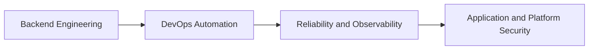

# Hello, I'm Abdellatif Hammadi

  

  

  
  

## About Me

- Backend engineer with hands-on experience building APIs and business systems.
- Strong base in PHP, Laravel, Symfony, Python, and Django.
- Currently shifting focus toward DevOps and security engineering.
- Interested in secure architecture, CI/CD quality gates, monitoring, and incident readiness.

## Current Focus

- Designing robust deployment pipelines with testing and security checks.
- Improving containerized workflows and environment consistency.
- Applying secure coding practices aligned with OWASP guidance.
- Building practical experience in observability and operational response.

## Engineering Direction

## Stack

### Backend

### Frontend

### DevOps and Security

### Databases and Tools

## GitHub Stats

  
  

  

## Contact

- LinkedIn: [linkedin.com/in/a-hammadi](https://linkedin.com/in/a-hammadi)
- Open to collaboration on backend, DevOps, and security-focused engineering projects.
